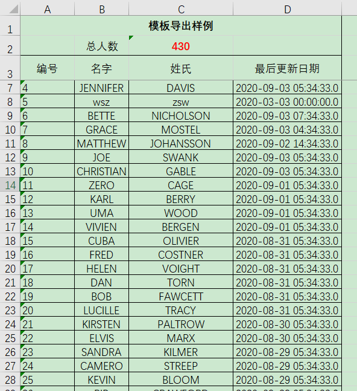

# SSM
Spring boot,Mybatis的整合总是很麻烦，在此提供一个已经整合好三大框架的包，可以直接下载导入Myeclipse使用，项目基于Maven做依赖管理。项目基于Mysql自带的Sakila数据库实现了MIS系统中常用的多个功能，运行前请安装好Mysql8.0。

其中包含的内容如下：

1.Spring boot 2.1.6,Mybatis3.2.2的整合；

2.前端框架采用https://adminlte.io ，后台的分页使用Mybatis的插件pagehelper实现；

3.数据库使用Mysql中自带的sakila数据库，使用前，请将application.yml中的spring.datasource.ssm.password中的数据库密码设置为自己的；

4.实现了sakila中的单表的增删改查和跨表查询，跨表查询包括了Mybatis的1-N和N-1双向映射；

5.添加定时任务：不再使用作业自动调度框架Quartz实现作业调度，使用spring框架自带的调度器进行作业调度，简化了配置。@Scheduled是单线程的，每次最多只有一个作业在运行，如果调度时间到了作业还没执行完，就会等待作业执行完，再等一个调度周期开启一个新的作业；

6.json插件使用阿里的开源fastjson工具,注意低版本的fastjson与swagger不兼容，这里有坑；

7.包含了一个文件上传的功能，可上传单个或多个文件；

8.Excel导入导出工具使用EasyPOI来完成：https://easypoi.mydoc.io/ ，想导出为Excel直接在PO中使用@Excel注解，例如

```
public class Actor implements Serializable{
	@ApiModelProperty("主键")
	@Excel(name = "编号", width=10)
	private Integer actor_id;
	
	@ApiModelProperty("名字")
	@Excel(name = "名字")
	private String first_name;
	
	@ApiModelProperty("姓氏")
	@Excel(name = "姓氏")
	private String last_name;
	
	@ApiModelProperty("最后更新日期")
	@Excel(name = "最后更新日期", width=20)
	private String last_update;
	......
	......
	
```
其中name用于设置导出的Excel字段名称，然后再添加接口就能完成Excel数据的导出：

```
@ApiOperation("单sheet导出-把演员导出为Excel")
@RequestMapping(value="/exportactor",method = RequestMethod.POST)
public void export(HttpServletResponse response) throws IOException{
	List<Actor> list = actorservice.getpageActors(1, 500);
	ExportParams exportParams = new ExportParams();
        exportParams.setSheetName("演员");
        exportParams.setType(ExcelType.XSSF);
        Workbook workbook = ExcelExportUtil.exportExcel(exportParams, Actor.class, list);
        response.setCharacterEncoding("utf-8");
        response.setHeader("content-Type", "application/vnd.ms-excel");
        response.setHeader("Content-Disposition", "attachment;filename=" + URLEncoder.encode("actor.xlsx" , "UTF-8"));
        workbook.write(response.getOutputStream());
}
```
如果要导入Excel数据到数据库，直接把Excel文件上传到接口，把文件转为PO列表写入数据库：

```
	@ApiOperation("导入Excel数据到演员表")
	@RequestMapping(value="/importactor",method = RequestMethod.POST)
	@ResponseBody
	public void importExcel(@RequestParam MultipartFile uploadfile) throws Exception{
		ImportParams params = new ImportParams();
		params.setHeadRows(1);
        List<Actor> list = ExcelImportUtil.importExcel(uploadfile.getInputStream(), Actor.class, params);
        list.forEach(a->System.out.println(a));
	}
```
还支持自定义样式的模板导出：



9.包含了登录功能以及登录权限验证的拦截器, **登录用户名tom，密码1234**, **用户表在staff中，可自行添加**  ；

10.要使用Struts2+hibernate+spring的整合，[点击这里进入](https://github.com/shenzhanwang/SSH_maven)  

11.去掉所有JSP，使用HTML代替，有利于前后端分离;

12.使用spring boot自带的日志工具logback，支持日志文件输出和控制台输出；

13.整合接口文档swagger2.9.2，入口http://localhost:8080/swagger-ui.html

14.将后台接口REST化，详情参考https://gitee.com/shenzhanwang/Spring-REST

15.添加mybatis的动态SQL的使用

16.访问入口：http://localhost:8080/login

17.要使用传统spring，切换分支到https://gitee.com/shenzhanwang/SSM/tree/master/

18.配置允许后台接口跨域

19.不再使用spring boot自带的数据源，改为使用alibaba druid数据源管理数据库连接。

20.添加异步任务，用于处理比较耗时的操作（例如Excel导入，大数据量的计算等），使用spring boot的异步任务实现。使用了注解@EnableAsync和@Async。该注解会在后台为我们自动地创建线程池执行异步任务，但是简化了代码量。

21.添加启动初始化作业，用于spring boot启动时完成一些必须的任务，比如缓存数据的预热加载。

22.添加JdbcTemplate方式查询数据库，可以用于快速添加多个数据源。

23.添加FTP文件下载功能，支持直接下载到本地，也可通过接口导出，还可以导出为BASE64编码。

24.包含树状结构后台生成工具。用于开发过程中生成层级树状结构，形同“编号”，“上级编号”的层级表结构。以单位层级结构为例，我们约定，顶级单位的上级单位字段为NULL。递归构建过程是：
- 查询全部单位表数据到内存
- 将单位表的PO转化为节点对象列表DwNode，这个过程需要设置单位编号、上级单位编号、单位名称等
- 传入节点对象列表List<DwNode>,使用TreeUtils.buildTree找到根节点，并递归调用TreeUtils.buildChildTree方法构建整个树状结构
- 上述算法的构建过程在DwCache.java中完成，会在spring boot启动时在内存中构建，需要导入dwb.sql才能看到效果。
- 对于根节点拥有多个的场景，需要调用TreeUtils.buildMultiTree实现。可参考行政区划树的生成方式XzqhCache.java，导入xzqh.sql才能看到效果。
25. 添加Aop登录切面LoginAspect统一拦截请求，若未登录则重定向到登录页面，切面LogAspect拦截所有接口的请求并将调用信息打印到日志。
26. 添加多数据源切换注解@DataSource，在数据库查询的service和mapper方法上加上以下注解即可完成对数据库的切换：

```
    @DataSource(DataSource.REST)
    public Item getItemById(Long id) {
        return itemMapper.selectByPrimaryKey(id);
    }
```
要继续新增数据源，需要去DataSource.java和DataSourceConfiguration.java中添加新的数据库配置。

效果图：


### 附录：中央技术储备仓库（Central Technique Reserve Repository）

#### 基础篇:职业化，从做好OA系统开始
1. [Spring boot整合Mybatis实现增删改查（支持多数据源）](https://gitee.com/shenzhanwang/SSM)
2. [Spring,SpringMVC和Hibernate的整合实现增删改查](https://gitee.com/shenzhanwang/SSH)
3. [Spring boot整合activiti工作流引擎实现OA开发](https://gitee.com/shenzhanwang/Spring-activiti)   
4. [Ruoyi-boot集成工作流引擎Flowable实例](https://gitee.com/shenzhanwang/Ruoyi-flowable) 
5. [Spring发布与调用REST风格的WebService](https://gitee.com/shenzhanwang/Spring-REST)
6. [Spring boot整合Axis调用SOAP风格的web服务](https://gitee.com/shenzhanwang/Spring-axis)
7. [Spring boot整合Apache Shiro实现RBAC权限控制](https://gitee.com/shenzhanwang/Spring-shiro)
8. [使用Spring security实现RBAC权限控制](https://gitee.com/shenzhanwang/spring-security-demo)
#### 中级篇：中间件的各种姿势
9. [Spring boot整合mongoDB文档数据库实现增删改查](https://gitee.com/shenzhanwang/Spring-mongoDB)
10. [Spring连接Redis实现缓存](https://gitee.com/shenzhanwang/Spring-redis)
11. [Spring连接图存数据库Neo4j实现增删改查](https://gitee.com/shenzhanwang/Spring-neo4j)
12. Spring boot整合列存数据库hbase实现增删改查
13. [Spring平台整合消息队列ActiveMQ实现发布订阅、生产者消费者模型（JMS）](https://gitee.com/shenzhanwang/Spring-activeMQ)
14. [Spring boot整合消息队列RabbitMQ实现四种消息模式（AMQP）](https://gitee.com/shenzhanwang/Spring-rabbitMQ)
15. Spring boot整合kafka 2.1.0实现大数据消息管道
16. [Spring boot整合websocket实现即时通讯](https://gitee.com/shenzhanwang/Spring-websocket)
17. [Spring security整合oauth2实现token认证](https://gitee.com/shenzhanwang/Spring-security-oauth2)
18. [Spring boot整合MinIO客户端实现文件管理](https://gitee.com/shenzhanwang/Spring-minio)
19. 23种设计模式，源码、注释、使用场景 
20. [使用ETL工具Kettle的实例](https://gitee.com/shenzhanwang/Kettle-demo)
21. Git指南和分支管理策略 
22. 使用数据仓库进行OLAP数据分析（Mysql+Kettle+Zeppelin）
#### 高级篇：分布式系统和大数据开发
23. [zookeeper原理、架构、使用场景和可视化](https://gitee.com/shenzhanwang/zookeeper-practice)
24. Spring boot整合Apache dubbo v2.7.5实现分布式服务治理（SOA架构）  
>  包含组件Spring boot v2.2.2+Dubbo v2.7.5+Nacos v1.1.1
<a href="https://images.gitee.com/uploads/images/2020/0114/084731_fd0b7a82_1110335.gif" target="_blank">效果图</a>
25. 使用Spring Cloud Alibaba v2.2.7实现微服务架构（MSA架构）   
>  包含组件Nacos+Feign+Gateway+Ribbon+Sentinel+Zipkin
<a href="https://images.gitee.com/uploads/images/2020/0106/201827_ac61db63_1110335.gif" target="_blank">效果图</a>
26. 使用jenkins+centos+git+maven搭建持续集成环境自动化部署分布式服务 
27. 使用docker+compose+jenkins+gitlab+spring cloud实现微服务的编排、持续集成和动态扩容 
28. 使用Spark进行分布式计算
- Spark SQL做离线计算
- Spark Streaming做实时计算
- Structured Streaming做实时计算
29. 使用Flink实现流批一体化的分布式计算
30. 搭建高可用nginx集群和Tomcat负载均衡 
31. 使用mycat实现Mysql数据库的主从复制、读写分离、分表分库、负载均衡和高可用 
32. [Spring boot整合Elastic search实现全文检索和大数据分析](https://gitee.com/shenzhanwang/Spring-elastic_search) 
#### 特别篇：分布式事务和并发控制
33. 基于可靠消息最终一致性实现分布式事务（activeMQ）
34. Spring boot dubbo整合seata实现分布式事务
> 包含组件nacos v2.0.2 + seata v1.4.2 +spring boot dubbo v2.7.5
<a href="https://images.gitee.com/uploads/images/2020/0119/112233_62a33a77_1110335.gif" target="_blank">效果图</a>
35. Spring cloud alibaba v2.2.7整合seata实现分布式事务 
> 包含组件nacos v2.0.2 + seata v1.4.2 +spring cloud alibaba v2.2.7
<a href="https://images.gitee.com/uploads/images/2020/0119/134408_ee14a016_1110335.gif" target="_blank">效果图</a>
36. 并发控制：数据库锁机制和事务隔离级别的实现 
37. 并发控制：使用redission实现分布式锁 
38. 并发控制：使用zookeeper实现分布式锁 
39. 并发控制：Java多线程编程实例
40. 并发控制：使用netty实现高性能NIO通信 
### 视频教程

<a href="https://www.roncoo.com/view/1551481849552183297" target="_blank">RuoYi-activiti开发指南</a>
### 关注微信公众号获取更多技术文章和源码
